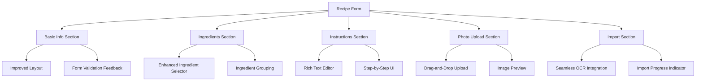
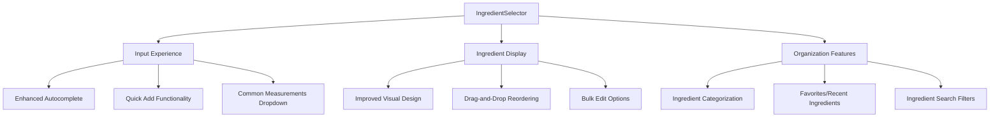
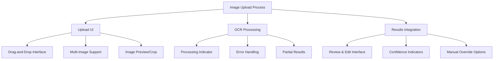

# Recipe Form and IngredientSelector UI Enhancement Plan

## Current State Analysis

After examining the current implementation of the recipe form and ingredient selector components, I've identified the following key aspects:

1. **Recipe Form Structure**
   - The form allows users to add recipes manually or import via image upload
   - Basic sections include title, meal type, diet type, ingredients, instructions, and photo upload
   - The form switches between manual entry and import mode

2. **IngredientSelector Component**
   - Recently updated to display separate fields for amount, unit, and ingredient name
   - Provides autocomplete suggestions from a Firestore database
   - Allows adding, editing, and removing ingredients

3. **OCR Functionality**
   - Uses Tesseract.js for text extraction from images
   - Parses extracted text to identify recipe components (title, ingredients, instructions)
   - Ingredients are parsed with regex to extract amount, unit, and ingredient name

4. **Current UI Limitations**
   - Limited visual feedback during OCR processing
   - Basic autocomplete for ingredients without categorization
   - No drag-and-drop for image uploads or ingredient reordering
   - Limited mobile responsiveness for ingredient fields

## Enhancement Goals

1. Improve the visual design and user experience of the recipe form
2. Enhance the ingredient selector with better autocomplete and organization
3. Create a smoother transition between manual entry and OCR import
4. Improve mobile responsiveness for all components

## Detailed Enhancement Plan

### 1. Recipe Form UI Improvements

#### Implementation Details:

1. **Redesign Form Layout**
   - Use a card-based design for each section with subtle shadows and rounded corners
   - Add visual separation between sections with dividers or spacing
   - Implement a progress indicator showing completion status of required fields
   - Use consistent styling for form elements (inputs, buttons, dropdowns)

2. **Improve Form Validation**
   - Add inline validation with visual indicators (green/red borders, icons)
   - Show validation errors directly beneath the relevant fields
   - Implement real-time validation as users type
   - Add a summary of validation errors at form submission

3. **Enhance Mobile Responsiveness**
   - Use a single-column layout on small screens
   - Increase touch target sizes for mobile users
   - Implement collapsible sections to save space
   - Optimize keyboard experience for mobile input

### 2. IngredientSelector Enhancements

#### Implementation Details:

1. **Enhanced Autocomplete**
   - Improve the matching algorithm to support fuzzy search
   - Show recently used ingredients at the top of suggestions
   - Add ingredient categories in the suggestion dropdown
   - Include common ingredient combinations as suggestions
   - Implement keyboard navigation for suggestions

2. **Improved Ingredient Display**
   - Create a more visually appealing ingredient list with cards
   - Add subtle color coding for different ingredient categories
   - Implement drag-and-drop reordering using react-beautiful-dnd
   - Add bulk edit capabilities for multiple ingredients
   - Include a "clear all" option for ingredients

3. **Smart Unit Handling**
   - Replace the unit text input with a dropdown of common units
   - Add unit conversion functionality (e.g., convert between metric and imperial)
   - Support fraction input for measurements with proper display
   - Add validation for amount fields (numbers and fractions only)

4. **Ingredient Organization**
   - Add ability to group ingredients by category (produce, dairy, etc.)
   - Implement collapsible sections for ingredient groups
   - Add a favorites or frequently used ingredients section
   - Include a search filter for the ingredient list

### 3. OCR and Image Upload Improvements

#### Implementation Details:

1. **Improved Upload Interface**
   - Add drag-and-drop functionality using react-dropzone
   - Support multiple image uploads with better visual feedback
   - Add image preview and basic cropping tools
   - Implement progress indicators for uploads

2. **Enhanced OCR Integration**
   - Show detailed processing status with progress indicators
   - Improve error handling with specific error messages
   - Allow partial extraction when complete OCR fails
   - Add a cancel option during processing

3. **Results Review Interface**
   - Create an interface to review and edit OCR results before finalizing
   - Highlight low-confidence extractions for review
   - Allow easy manual corrections with side-by-side comparison
   - Provide a summary of extracted data

### 4. Technical Implementation Plan

1. **Component Refactoring**
   - Break down large components into smaller, focused ones
   - Implement proper component composition
   - Ensure consistent prop interfaces
   - Add PropTypes or TypeScript interfaces for better type safety

2. **State Management Improvements**
   - Refine the useRecipeForm hook for better state management
   - Implement form state persistence using localStorage
   - Add undo/redo functionality for form changes
   - Consider using React Context for shared state

3. **Performance Optimizations**
   - Implement virtualization for large ingredient lists using react-window
   - Add debouncing for autocomplete searches
   - Optimize image processing and rendering
   - Use React.memo for pure components

4. **Accessibility Enhancements**
   - Ensure proper keyboard navigation throughout the form
   - Add ARIA attributes for screen readers
   - Implement focus management for modals and dropdowns
   - Ensure sufficient color contrast for all UI elements

## Implementation Phases

### Phase 1: Core UI Improvements (2 weeks)
- Redesign the basic form layout
- Enhance the ingredient input fields
- Improve mobile responsiveness
- Implement form validation improvements

### Phase 2: Ingredient Selector Enhancements (2 weeks)
- Implement enhanced autocomplete
- Add unit dropdown and conversion
- Improve ingredient display and organization
- Add drag-and-drop reordering

### Phase 3: OCR and Image Upload Improvements (2 weeks)
- Enhance image upload interface
- Improve OCR processing feedback
- Create results review interface
- Implement error handling improvements

### Phase 4: Polish and Refinement (1 week)
- Add animations and transitions
- Implement accessibility improvements
- Conduct user testing and make refinements
- Fix any bugs or issues identified

## Technical Considerations

- Ensure backward compatibility with existing data
- Maintain performance with large recipe datasets
- Consider browser compatibility for modern UI features
- Implement proper error handling throughout

## Required Dependencies

- **UI Components**: 
  - react-beautiful-dnd (drag-and-drop)
  - react-dropzone (file uploads)
  - react-select (enhanced dropdowns)
  - react-window (virtualized lists)

- **State Management**:
  - Use React Context or consider Redux for complex state
  - Implement localStorage for persistence

- **Styling**:
  - Continue with CSS Modules
  - Consider adding a design system like Material-UI or Chakra UI

## Conclusion

This enhancement plan provides a comprehensive roadmap for improving the recipe form and ingredient selector UI. By implementing these changes in phases, we can deliver a more intuitive, efficient, and visually appealing experience for users when adding recipes manually or via OCR.