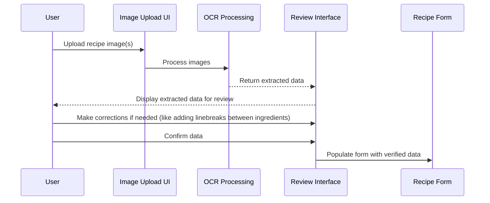
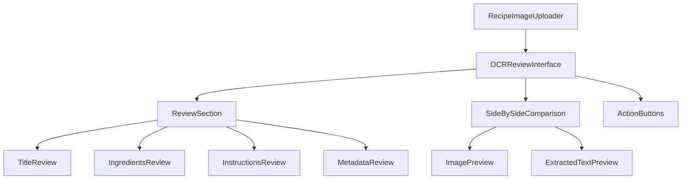

# OCR Review and Edit Interface - Detailed Implementation Plan

## Overview

The OCR Review and Edit Interface will provide users with a way to review and correct the data extracted from recipe images before finalizing it in the recipe form. This interface will be shown after OCR processing completes and before the data is populated into the main recipe form.

## User Flow



## Component Structure



## Detailed Component Specifications

### 1. OCRReviewInterface Component

This will be the main container component for the review interface.

```jsx
// OCRReviewInterface.js
import React, { useState } from 'react';
import ReviewSection from './ReviewSection';
import SideBySideComparison from './SideBySideComparison';
import ActionButtons from './ActionButtons';
import styles from './OCRReviewInterface.module.css';

const OCRReviewInterface = ({ 
  extractedData, 
  originalImages, 
  rawOcrText,
  onConfirm, 
  onCancel,
  confidenceScores // Optional: confidence scores for different sections
}) => {
  const [editedData, setEditedData] = useState(extractedData);
  const [activeSection, setActiveSection] = useState('title');
  const [activeImageIndex, setActiveImageIndex] = useState(0);
  
  const handleDataChange = (section, value) => {
    setEditedData(prev => ({
      ...prev,
      [section]: value
    }));
  };
  
  const handleConfirm = () => {
    onConfirm(editedData);
  };
  
  return (
    <div className={styles.container}>
      <h2 className={styles.title}>Review Extracted Recipe</h2>
      
      <div className={styles.reviewLayout}>
        <div className={styles.reviewPanel}>
          <ReviewSection 
            extractedData={editedData}
            onDataChange={handleDataChange}
            activeSection={activeSection}
            setActiveSection={setActiveSection}
            confidenceScores={confidenceScores}
          />
        </div>
        
        <div className={styles.comparisonPanel}>
          <SideBySideComparison 
            images={originalImages}
            rawText={rawOcrText}
            activeImageIndex={activeImageIndex}
            setActiveImageIndex={setActiveImageIndex}
            activeSection={activeSection}
          />
        </div>
      </div>
      
      <ActionButtons 
        onConfirm={handleConfirm}
        onCancel={onCancel}
      />
    </div>
  );
};

export default OCRReviewInterface;
```

### 2. ReviewSection Component

This component will contain sections for reviewing different parts of the recipe.

```jsx
// ReviewSection.js
import React from 'react';
import TitleReview from './TitleReview';
import IngredientsReview from './IngredientsReview';
import InstructionsReview from './InstructionsReview';
import MetadataReview from './MetadataReview';
import styles from './ReviewSection.module.css';

const ReviewSection = ({ 
  extractedData, 
  onDataChange, 
  activeSection, 
  setActiveSection,
  confidenceScores
}) => {
  const sections = [
    { id: 'title', label: 'Title' },
    { id: 'ingredients', label: 'Ingredients' },
    { id: 'instructions', label: 'Instructions' },
    { id: 'metadata', label: 'Additional Info' }
  ];
  
  return (
    <div className={styles.container}>
      <div className={styles.tabs}>
        {sections.map(section => (
          <button
            key={section.id}
            className={`${styles.tab} ${activeSection === section.id ? styles.activeTab : ''}`}
            onClick={() => setActiveSection(section.id)}
          >
            {section.label}
            {confidenceScores && confidenceScores[section.id] && (
              <ConfidenceIndicator score={confidenceScores[section.id]} />
            )}
          </button>
        ))}
      </div>
      
      <div className={styles.sectionContent}>
        {activeSection === 'title' && (
          <TitleReview 
            title={extractedData.title} 
            onChange={value => onDataChange('title', value)}
            confidence={confidenceScores?.title}
          />
        )}
        
        {activeSection === 'ingredients' && (
          <IngredientsReview 
            ingredients={extractedData.ingredients} 
            onChange={value => onDataChange('ingredients', value)}
            confidence={confidenceScores?.ingredients}
          />
        )}
        
        {activeSection === 'instructions' && (
          <InstructionsReview 
            instructions={extractedData.instructions} 
            onChange={value => onDataChange('instructions', value)}
            confidence={confidenceScores?.instructions}
          />
        )}
        
        {activeSection === 'metadata' && (
          <MetadataReview 
            metadata={{
              prepTime: extractedData.prepTime,
              cookTime: extractedData.cookTime,
              servings: extractedData.servings,
              mealType: extractedData.mealType,
              dietType: extractedData.dietType
            }} 
            onChange={(field, value) => onDataChange(field, value)}
            confidence={confidenceScores?.metadata}
          />
        )}
      </div>
    </div>
  );
};

export default ReviewSection;
```

### 3. Confidence Indicator Component

This component will visually indicate the confidence level of the OCR extraction.

```jsx
// ConfidenceIndicator.js
import React from 'react';
import styles from './ConfidenceIndicator.module.css';

const ConfidenceIndicator = ({ score }) => {
  // Determine color based on confidence score
  let colorClass = styles.high;
  if (score < 0.5) {
    colorClass = styles.low;
  } else if (score < 0.8) {
    colorClass = styles.medium;
  }
  
  return (
    <div className={`${styles.indicator} ${colorClass}`} title={`Confidence: ${Math.round(score * 100)}%`}>
      <div className={styles.dot}></div>
      {score >= 0.8 && <span className={styles.checkmark}>✓</span>}
      {score < 0.5 && <span className={styles.warning}>!</span>}
    </div>
  );
};

export default ConfidenceIndicator;
```

### 4. IngredientsReview Component

This component will allow reviewing and editing the extracted ingredients.

```jsx
// IngredientsReview.js
import React from 'react';
import styles from './IngredientsReview.module.css';

const IngredientsReview = ({ ingredients, onChange, confidence }) => {
  const handleIngredientChange = (index, field, value) => {
    const updatedIngredients = [...ingredients];
    updatedIngredients[index] = {
      ...updatedIngredients[index],
      [field]: value
    };
    onChange(updatedIngredients);
  };
  
  const handleAddIngredient = () => {
    onChange([...ingredients, { amount: '', unit: '', ingredientId: '' }]);
  };
  
  const handleRemoveIngredient = (index) => {
    onChange(ingredients.filter((_, i) => i !== index));
  };
  
  return (
    <div className={styles.container}>
      <div className={styles.header}>
        <h3>Ingredients</h3>
        {confidence !== undefined && (
          <div className={styles.confidenceWrapper}>
            <span>Confidence: {Math.round(confidence * 100)}%</span>
            <div 
              className={styles.confidenceBar}
              style={{ width: `${confidence * 100}%` }}
            ></div>
          </div>
        )}
      </div>
      
      <div className={styles.ingredientsList}>
        {ingredients.map((ingredient, index) => (
          <div key={index} className={styles.ingredientRow}>
            <input
              type="text"
              className={styles.amountField}
              value={ingredient.amount || ''}
              onChange={(e) => handleIngredientChange(index, 'amount', e.target.value)}
              placeholder="Amount"
            />
            <input
              type="text"
              className={styles.unitField}
              value={ingredient.unit || ''}
              onChange={(e) => handleIngredientChange(index, 'unit', e.target.value)}
              placeholder="Unit"
            />
            <input
              type="text"
              className={styles.ingredientField}
              value={ingredient.ingredientId || ''}
              onChange={(e) => handleIngredientChange(index, 'ingredientId', e.target.value)}
              placeholder="Ingredient"
            />
            <button
              type="button"
              className={styles.removeButton}
              onClick={() => handleRemoveIngredient(index)}
            >
              ×
            </button>
          </div>
        ))}
      </div>
      
      <button
        type="button"
        className={styles.addButton}
        onClick={handleAddIngredient}
      >
        + Add Ingredient
      </button>
    </div>
  );
};

export default IngredientsReview;
```

### 5. SideBySideComparison Component

This component will show the original image alongside the extracted text.

```jsx
// SideBySideComparison.js
import React from 'react';
import styles from './SideBySideComparison.module.css';

const SideBySideComparison = ({ 
  images, 
  rawText, 
  activeImageIndex, 
  setActiveImageIndex,
  activeSection 
}) => {
  // Split raw text into sections for highlighting
  const textSections = {
    title: extractTitleSection(rawText),
    ingredients: extractIngredientsSection(rawText),
    instructions: extractInstructionsSection(rawText),
    metadata: extractMetadataSection(rawText)
  };
  
  return (
    <div className={styles.container}>
      <div className={styles.imagePanel}>
        <h3>Original Image</h3>
        {images.length > 0 ? (
          <>
            <div className={styles.imageContainer}>
              
            </div>
            
            {images.length > 1 && (
              <div className={styles.imageThumbnails}>
                {images.map((image, index) => (
                  <div 
                    key={index}
                    className={`${styles.thumbnail} ${index === activeImageIndex ? styles.activeThumbnail : ''}`}
                    onClick={() => setActiveImageIndex(index)}
                  >
                    
                  </div>
                ))}
              </div>
            )}
          </>
        ) : (
          <div className={styles.noImage}>No image available</div>
        )}
      </div>
      
      <div className={styles.textPanel}>
        <h3>Extracted Text</h3>
        <div className={styles.textContainer}>
          {rawText ? (
            <pre className={styles.rawText}>
              {highlightSection(rawText, textSections[activeSection])}
            </pre>
          ) : (
            <div className={styles.noText}>No text extracted</div>
          )}
        </div>
      </div>
    </div>
  );
};

// Helper functions to extract and highlight text sections
function extractTitleSection(text) {
  // Simple implementation - in practice, this would use more sophisticated parsing
  const lines = text.split('\n');
  return lines.length > 0 ? { start: 0, end: 1 } : null;
}

function extractIngredientsSection(text) {
  // Find the ingredients section in the text
  const ingredientsMatch = text.match(/ingredients?[:\s]+([\s\S]+?)(?=instructions|directions|method|steps|$)/i);
  if (ingredientsMatch) {
    const startIndex = text.indexOf(ingredientsMatch[0]);
    const endIndex = startIndex + ingredientsMatch[0].length;
    return { start: startIndex, end: endIndex };
  }
  return null;
}

function extractInstructionsSection(text) {
  // Find the instructions section in the text
  const instructionsMatch = text.match(/(?:instructions|directions|method|steps)[:\s]+([\s\S]+)$/i);
  if (instructionsMatch) {
    const startIndex = text.indexOf(instructionsMatch[0]);
    const endIndex = text.length;
    return { start: startIndex, end: endIndex };
  }
  return null;
}

function extractMetadataSection(text) {
  // This would extract prep time, cook time, servings, etc.
  // Simplified implementation
  return null;
}

function highlightSection(text, section) {
  if (!section) return text;
  
  const before = text.substring(0, section.start);
  const highlighted = text.substring(section.start, section.end);
  const after = text.substring(section.end);
  
  return (
    <>
      {before}
      <span className={styles.highlightedText}>{highlighted}</span>
      {after}
    </>
  );
}

export default SideBySideComparison;
```

### 6. ActionButtons Component

```jsx
// ActionButtons.js
import React from 'react';
import styles from './ActionButtons.module.css';

const ActionButtons = ({ onConfirm, onCancel }) => {
  return (
    <div className={styles.container}>
      <button
        type="button"
        className={styles.cancelButton}
        onClick={onCancel}
      >
        Cancel
      </button>
      <button
        type="button"
        className={styles.confirmButton}
        onClick={onConfirm}
      >
        Confirm & Continue
      </button>
    </div>
  );
};

export default ActionButtons;
```

## CSS Styling

Here's a sample of the CSS styling for the main OCRReviewInterface component:

```css
/* OCRReviewInterface.module.css */
.container {
  width: 100%;
  max-width: 1200px;
  margin: 0 auto;
  padding: 20px;
  background-color: #FAFAFA;
  border-radius: 12px;
  box-shadow: 0 4px 12px rgba(0, 0, 0, 0.1);
}

.title {
  text-align: center;
  margin-bottom: 24px;
  color: #333;
  font-size: 1.5rem;
}

.reviewLayout {
  display: flex;
  flex-direction: row;
  gap: 24px;
  margin-bottom: 24px;
}

.reviewPanel {
  flex: 1;
  min-width: 0;
}

.comparisonPanel {
  flex: 1;
  min-width: 0;
}

/* Responsive layout */
@media (max-width: 768px) {
  .reviewLayout {
    flex-direction: column;
  }
}
```

## Integration with RecipeImageUploader

To integrate this review interface with the existing RecipeImageUploader component, we'll need to modify the component to show the review interface after OCR processing:

```jsx
// Modified RecipeImageUploader.js
import React, { useState } from 'react';
import { processRecipeImages } from '../../../../services/ocrService';
import OCRReviewInterface from './OCRReviewInterface';
import styles from './RecipeImageUploader.module.css';

const RecipeImageUploader = ({ onRecipeExtracted, onCancel }) => {
  const [images, setImages] = useState([]);
  const [isProcessing, setIsProcessing] = useState(false);
  const [error, setError] = useState('');
  const [extractedData, setExtractedData] = useState(null);
  const [rawOcrText, setRawOcrText] = useState('');
  const [showReviewInterface, setShowReviewInterface] = useState(false);
  
  // ... existing code for handling image upload, etc.
  
  // Process the images when submit button is clicked
  const handleSubmit = async () => {
    if (images.length === 0) {
      setError('Please add at least one image');
      return;
    }

    setIsProcessing(true);
    setError('');

    try {
      // Process images using the OCR service
      console.log('Processing images:', images.length);
      const result = await processRecipeImages(images);
      
      // Store the extracted recipe and raw OCR text
      setExtractedData(result.recipe);
      setRawOcrText(result.rawText);
      
      // Show the review interface
      setShowReviewInterface(true);
    } catch (err) {
      setError('Failed to process images: ' + (err.message || 'Unknown error'));
      console.error('Image processing error:', err);
    } finally {
      setIsProcessing(false);
    }
  };
  
  // Handle confirmation from review interface
  const handleReviewConfirm = (reviewedData) => {
    // Pass the reviewed data back to the parent component
    if (onRecipeExtracted) {
      onRecipeExtracted(reviewedData);
    }
    
    // Clear the images and reset state
    clearImages();
    setShowReviewInterface(false);
  };
  
  // Handle cancellation from review interface
  const handleReviewCancel = () => {
    setShowReviewInterface(false);
  };
  
  // If showing review interface, render it instead of the upload UI
  if (showReviewInterface) {
    return (
      <OCRReviewInterface
        extractedData={extractedData}
        originalImages={images}
        rawOcrText={rawOcrText}
        onConfirm={handleReviewConfirm}
        onCancel={handleReviewCancel}
      />
    );
  }
  
  // Otherwise, render the normal upload UI
  return (
    <div className={styles.container}>
      {/* ... existing upload UI code ... */}
    </div>
  );
};

export default RecipeImageUploader;
```

## Modifications to OCR Service

To support confidence scores and better section extraction, we'll need to modify the OCR service:

```javascript
// Modified ocrService.js
export async function processRecipeImages(images) {
  try {
    let combinedText = '';
    let errorCount = 0;
    
    for (const image of images) {
      try {
        const text = await extractRawTextFromImage(image);
        if (text && text.trim()) {
          combinedText += text + '\n\n';
        }
      } catch (err) {
        errorCount++;
        console.warn(`Failed to process image: ${err.message}`);
      }
    }

    if (combinedText.trim().length === 0) {
      throw new Error('No text could be extracted from any of the images');
    }

    console.log('Combined text from all images:', combinedText.substring(0, 100) + '...');

    // Clean and structure the text
    const { recipe, confidenceScores } = await cleanRecipeText(combinedText);
    
    // Normalize the recipe structure
    const normalizedRecipe = normalizeRecipe(recipe);
    
    // Validate the recipe
    validateRecipe(normalizedRecipe);
    
    return {
      recipe: normalizedRecipe,
      rawText: combinedText,
      confidenceScores
    };
  } catch (error) {
    console.error('Recipe processing error:', error);
    throw new Error(error.message || 'Failed to process recipe images');
  }
}
```

## Implementation Considerations

1. **Confidence Scoring**:
   - Implement a simple heuristic-based confidence scoring system
   - For title: Check if it looks like a title (capitalized, short, at the beginning)
   - For ingredients: Check if they match expected patterns
   - For instructions: Check for numbered steps or clear paragraph breaks

2. **Performance**:
   - Use React.memo for pure components to prevent unnecessary re-renders
   - Implement lazy loading for images in the side-by-side comparison
   - Consider using a virtualized list for long ingredients or instructions lists

3. **Accessibility**:
   - Ensure all form controls have proper labels
   - Add ARIA attributes for screen readers
   - Implement keyboard navigation for the review interface
   - Ensure sufficient color contrast for confidence indicators

4. **Error Handling**:
   - Add fallbacks for missing or corrupted data
   - Provide clear error messages for OCR failures
   - Allow manual entry as a fallback when OCR fails

## Next Steps

1. Implement the basic component structure
2. Add styling for the review interface
3. Integrate with the existing RecipeImageUploader
4. Implement confidence scoring in the OCR service
5. Add tests for the new components
6. Conduct user testing and refine the interface based on feedback

This detailed implementation plan provides a comprehensive roadmap for creating an OCR review and edit interface that will significantly improve the user experience when importing recipes from images.